# CLRS Kit Español

**clrs-kit-esp** es una extensión para Visual Studio Code orientada al soporte de un lenguaje de pseudocódigo, fuertemente inspirado en la sintaxis utilizada en el libro Introducción a Algoritmos (CLRS).

## 💻 Inicio rápido

| Extensión de archivo | Descripción |
|----------------------|-------------|
| `.clrs` | Recomendada para habilitar las herramientas integradas en VS Code. Puedes ejecutar archivos con otras extensiones, pero no contarán con el soporte de la extensión. |

### Recomendado:

[](https://marketplace.visualstudio.com/items?itemName=zhuangtongfa.Material-theme)
[](https://www.jetbrains.com/es-es/lp/mono/)

---

## ⌨️ Comandos para VS Code

| Paleta de comandos | Descripción |
|--------------------|-------------|
| Ejecutar código CLRS | Transpila el código a JavaScript y lo ejecuta inmediatamente. |
| Generar código JavaScript | Transpila el código a un archivo `.js` listo para usar, sin ejecutarlo. |
| Mostrar/ocultar costo algorítmico | Muestra u oculta el costo algorítmico de cada instrucción mediante expresiones simbólicas basadas en operaciones elementales. |
| Mostrar diagrama de flujo | Genera automáticamente un diagrama de flujo del código y lo muestra en un panel interactivo junto al editor. |
| Exportar diagrama de flujo PNG | Exporta el diagrama de flujo generado como una imagen PNG de alta resolución para su uso en documentación, reportes o presentaciones. |

---

## ⚙️ Estado actual (versión 1.2.8)

- Parser completo de CLRS construido con Chevrotain.
- Generación automática del Árbol de Sintaxis Abstracta (AST).
- Transpilador de CLRS a JavaScript.
- Ejecución de programas CLRS directamente desde Visual Studio Code.
- Generación de código JavaScript sin necesidad de ejecutarlo.
- Resaltado de sintaxis mediante una gramática TextMate.
- Configuración del lenguaje con indentación automática y plegado de código.
- Snippets integrados para la sintaxis de CLRS.
- Biblioteca estándar para manejo de archivos, cadenas, arreglos y funciones matemáticas.
- Reporte de errores de sintaxis y de ejecución.
- Soporte para funciones, arreglos, expresiones, condicionales, ciclos y operaciones de entrada/salida.
- Soporte para el uso de botón para ejecutar y construir.
- Soporte para muestreo de costo algorítmico.
- Soporte para muestreo de diagrama de flujo en tiempo real.
- Exportación de diagrama de flujo en formato PNG.

---

## 📖 Filosofía del lenguaje

El lenguaje está diseñado bajo los siguientes principios:

- Sintaxis de pseudocódigo simple y cercana al español.
- Enfoque educativo y académico.
- Simplicidad para principiantes.
- Similitud con pseudocódigo CLRS.
- Caso de uso enfocado en el diseño y aprendizaje de algoritmos.

---

## 🛠️ Requisitos

- Visual Studio Code
- Node.js (para la ejecución)

---

## 📜 Licencia (GPLv2)

Este proyecto es de código abierto. Puede ser modificado y extendido libremente, siempre que se mantenga la atribución al autor original.

---

## ⚠️ Problemas conocidos

* No hay soporte para el análisis semántico. Por lo que todo es realizado en el análisis de JavaScript sin especificar la localización del error.
* Es posible que determinado código se genere de manera incorrecta por el transpilador.

---

# 🧮 Características del lenguaje

## Comentarios

CLRS únicamente admite comentarios de una sola línea mediante `//`.

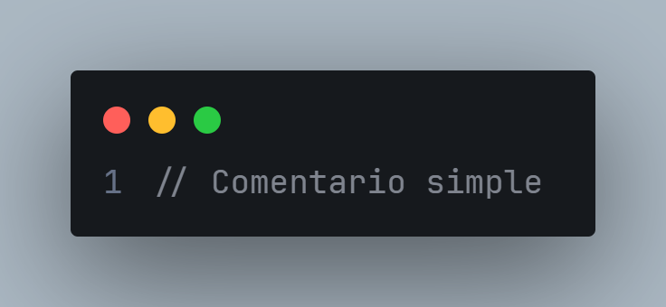

<details>
<summary>Copiar código</summary>

```clrs-es
// Comentario simple
```

</details>

## Variables

Las variables son dinámicas y débilmente tipadas. Esto significa que pueden almacenar valores de distintos tipos y cambiar de tipo durante la ejecución mediante conversiones implícitas cuando sea necesario.

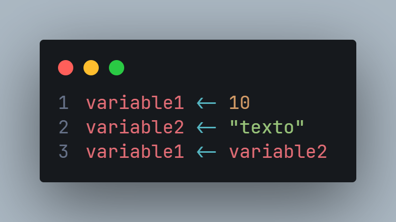

<details>
<summary>Copiar código</summary>

```clrs-es
variable1 <- 10
variable2 <- "texto"
variable1 <- variable2
```

</details>

Las variables son siempre mutables; el lenguaje no dispone de constantes. Su ámbito es local a la función donde se definen y la asignación se realiza mediante el operador `<-`.

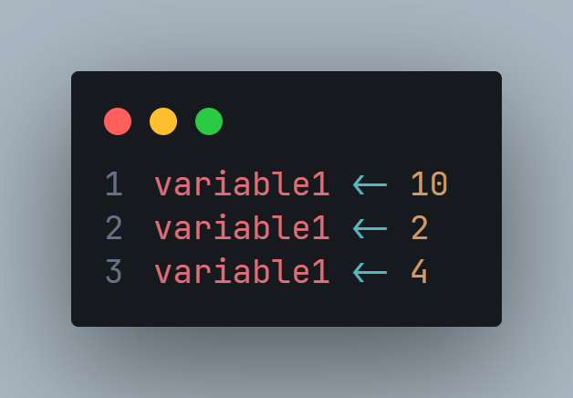

<details>
<summary>Copiar código</summary>

```clrs-es
variable1 <- 10
variable1 <- 2
variable1 <- 4
```

</details>

Las variables deben inicializarse en el momento de su creación, por lo que no es posible declararlas sin asignarles un valor inicial. Los valores admitidos son numéricos, cadenas y lógicos.

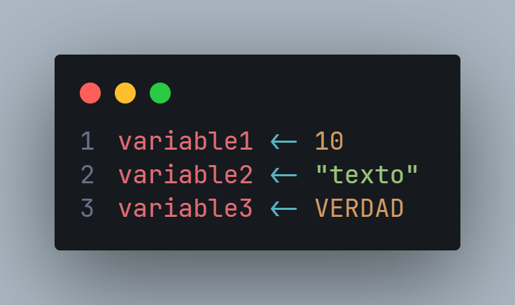

<details>
<summary>Copiar código</summary>

```clrs-es
variable1 <- 10
variable2 <- "texto"
variable3 <- VERDAD
```

</details>

## Arreglos

Los arreglos son dinámicos. Su tamaño y número de dimensiones se determinan automáticamente conforme se accede a nuevas posiciones.

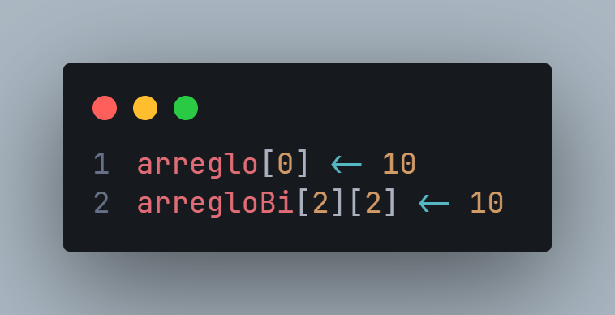

<details>
<summary>Copiar código</summary>

```clrs-es
arreglo[0] <- 10
arregloBi[2][2] <- 10
```

</details>

Es posible asignar un arreglo completo a una variable o el contenido de una variable a un arreglo. En ambos casos, la asignación copia el contenido correspondiente.

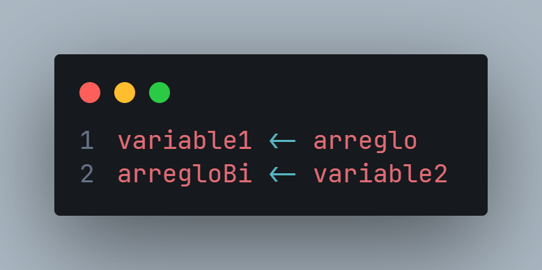

<details>
<summary>Copiar código</summary>

```clrs-es
variable1 <- arreglo
arregloBi <- variable2
```

</details>

## Entrada y salida

La instrucción `escribir` permite mostrar información en la consola. Puede imprimir valores individuales, varios valores separados por comas, expresiones concatenadas y arreglos completos.

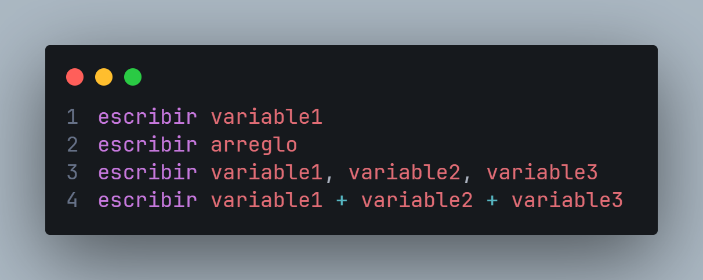

<details>
<summary>Copiar código</summary>

```clrs-es
escribir variable1
escribir arreglo
escribir variable1, variable2, variable3
escribir variable1 + variable2 + variable3
```

</details>

La instrucción `leer` permite obtener datos desde la consola. Es posible leer una o varias variables en una sola instrucción. El tipo del valor leído se determina automáticamente.

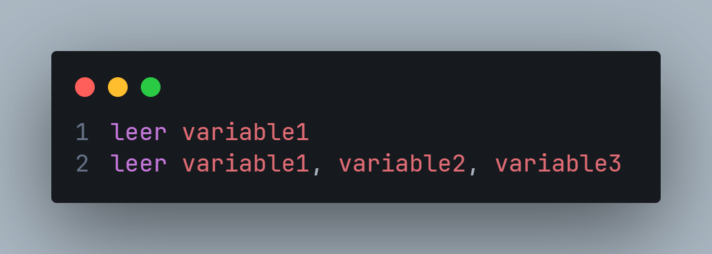

<details>
<summary>Copiar código</summary>

```clrs-es
leer variable1
leer variable1, variable2, variable3
```

</details>

## Estructuras de selección

La única estructura de selección es `si`, junto con las variantes `sino si` y `sino`. Los bloques de código se delimitan mediante indentación, por lo que es importante mantener una indentación consistente.

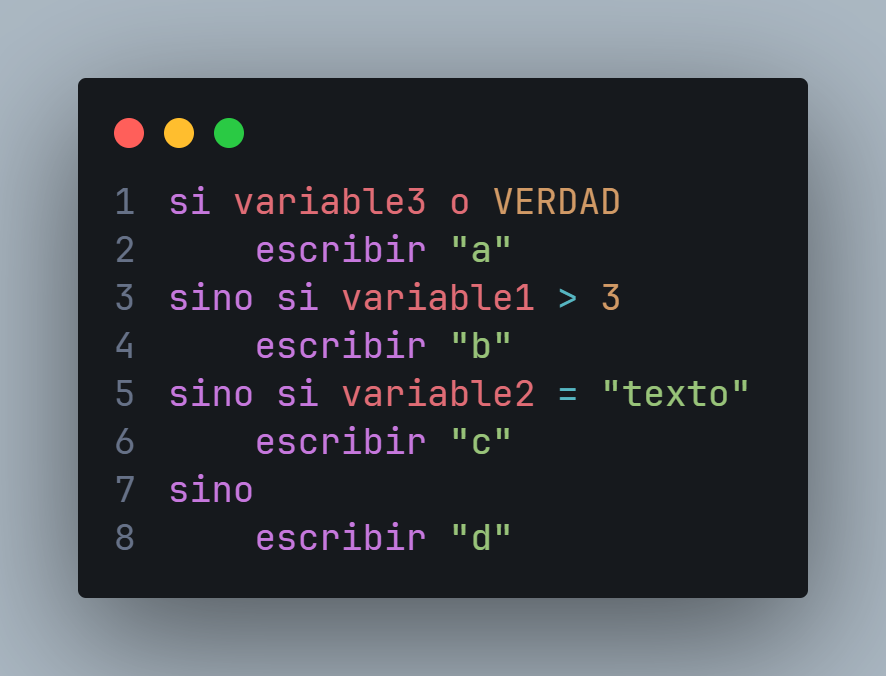

<details>
<summary>Copiar código</summary>

```clrs-es
si variable3 o VERDAD
    escribir "a"
sino si variable1 > 3
    escribir "b"
sino si variable2 = "texto"
    escribir "c"
sino
    escribir "d"
```

</details>

## Operadores

CLRS dispone de operadores lógicos, relacionales y aritméticos similares a los de otros lenguajes. La comparación de igualdad utiliza el operador `=`.

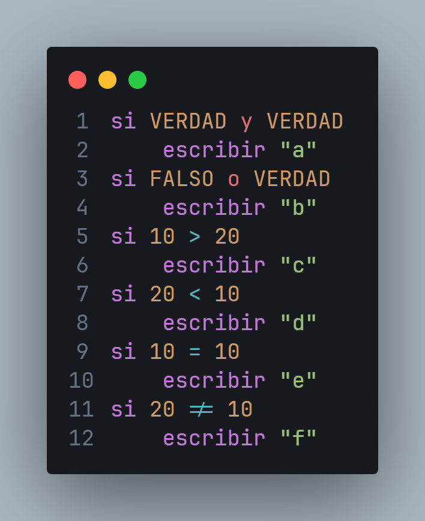

<details>
<summary>Copiar código</summary>

```clrs-es
si VERDAD y VERDAD
    escribir "a"
si FALSO o VERDAD
    escribir "b"
si 10 > 20
    escribir "c"
si 20 < 10
    escribir "d"
si 10 = 10
    escribir "e"
si 20 != 10
    escribir "f"
```

</details>

## Ciclo `para`

La estructura `para` dispone de dos variantes.

La variante `hasta` incrementa automáticamente la variable de iteración hasta que alcance el valor indicado por la expresión final.

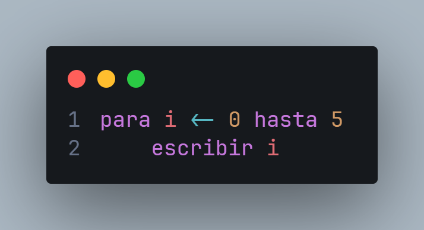

<details>
<summary>Copiar código</summary>

```clrs-es
para i <- 0 hasta 5
    escribir i
```

</details>

La variante `bajando` decrementa automáticamente la variable de iteración hasta alcanzar el valor indicado.

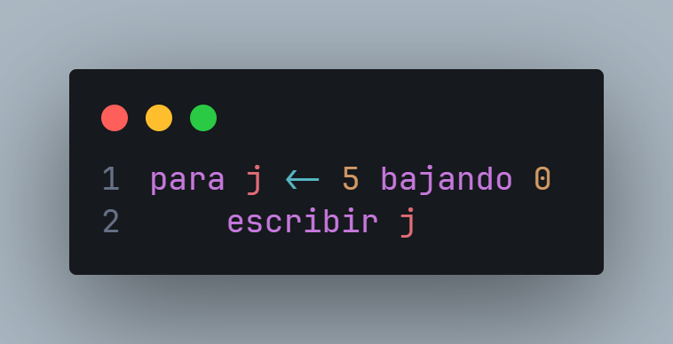

<details>
<summary>Copiar código</summary>

```clrs-es
para j <- 5 bajando 0
    escribir j
```

</details>

## Ciclo `mientras`

La estructura `mientras` ejecuta repetidamente un bloque de instrucciones mientras la condición evaluada sea verdadera.

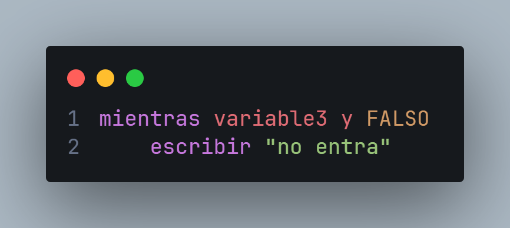

<details>
<summary>Copiar código</summary>

```clrs-es
mientras variable3 y FALSO
    escribir "no entra"
```

</details>

## Funciones

Las funciones se definen mediante un identificador, una lista de parámetros y un bloque de código. La convención usada en el libro CLRS para la declaración de funciones se basa en el uso de mayúsculas y `_` para la separación de palabras.

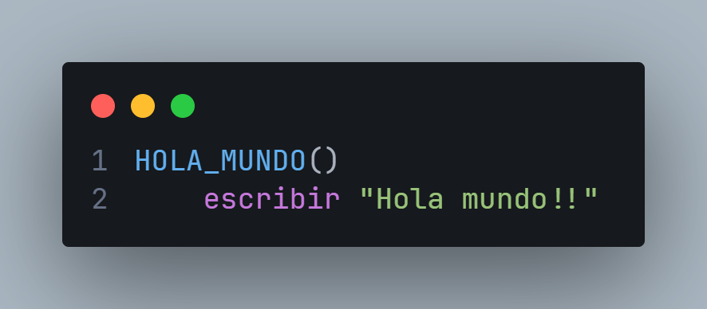

<details>
<summary>Copiar código</summary>

```clrs-es
HOLA_MUNDO()
    escribir "Hola mundo!!"
```

</details>

Su invocación utiliza la misma sintaxis que su definición. Después de una llamada no debe agregarse un bloque indentado, ya que este podría interpretarse como el cuerpo de una nueva función.

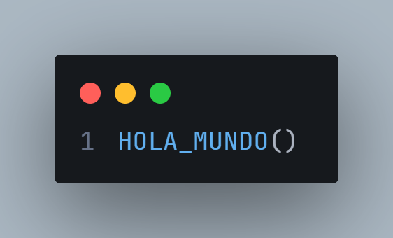

<details>
<summary>Copiar código</summary>

```clrs-es
HOLA_MUNDO()
```

</details>

Las funciones pueden recibir cualquier cantidad de parámetros y devolver un valor mediante la instrucción `retornar`.

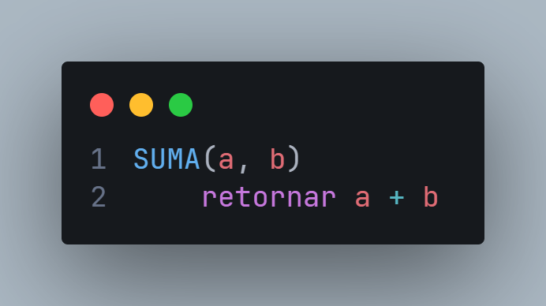

<details>
<summary>Copiar código</summary>

```clrs-es
SUMA(a, b)
    retornar a + b
```

</details>

También es posible recibir arreglos como parámetros. Para ello únicamente se especifica el número de dimensiones del arreglo.

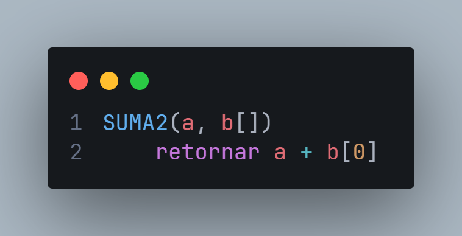

<details>
<summary>Copiar código</summary>

```clrs-es
SUMA2(a, b[])
    retornar a + b[0]
```

</details>

Las llamadas a funciones pueden utilizarse como parte de cualquier expresión. Los arreglos se pasan simplemente mediante su identificador.

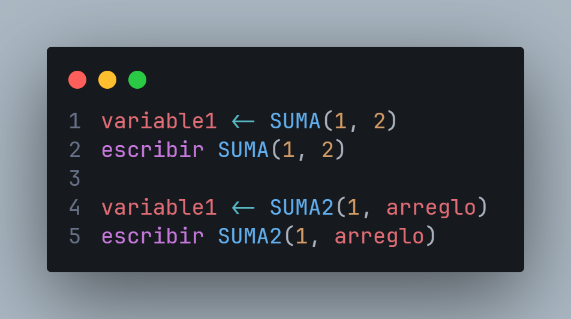

<details>
<summary>Copiar código</summary>

```clrs-es
variable1 <- SUMA(1, 2)
escribir SUMA(1, 2)

variable1 <- SUMA2(1, arreglo)
escribir SUMA2(1, arreglo)
```

</details>

Es posible utilizar como identificador `PRINCIPAL` en una función para usarlo como punto de entrada. No es necesario realizar una llamada explícita.

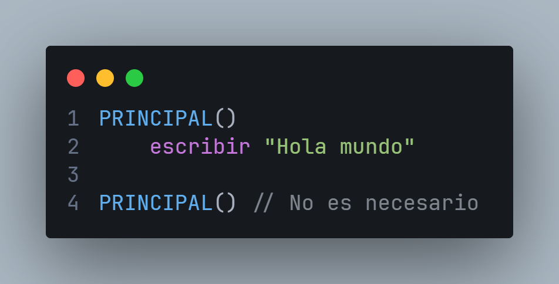

<details>
<summary>Copiar código</summary>

```clrs-es
PRINCIPAL()
    escribir "Hola mundo"

PRINCIPAL() // No es necesario
```

</details>

## Ejemplo

Ejemplo completo de Bubble Sort.

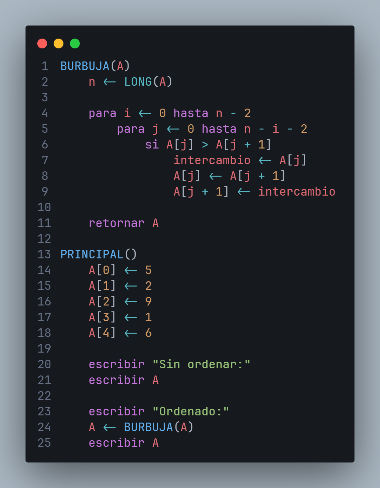

<details>
<summary>Copiar código</summary>

```clrs-es
BURBUJA(A)
    n <- LONG(A)

    para i <- 0 hasta n - 2
        para j <- 0 hasta n - i - 2
            si A[j] > A[j + 1]
                intercambio <- A[j]
                A[j] <- A[j + 1]
                A[j + 1] <- intercambio

    retornar A

PRINCIPAL()
    A[0] <- 5
    A[1] <- 2
    A[2] <- 9
    A[3] <- 1
    A[4] <- 6

    escribir "Sin ordenar:"
    escribir A

    escribir "Ordenado:"
    A <- BURBUJA(A)
    escribir A
```

</details>

---

# 📚 Biblioteca estándar de CLRS

La biblioteca estándar de CLRS proporciona funciones integradas para manejo de archivos, operaciones matemáticas, cadenas y arreglos.

---

## 📁 Archivos

| Función CLRS | Descripción | Retorno |
|--------------|-------------|---------|
| `LEER_ARCHIVO(ruta)` | Lee el contenido de un archivo de texto. | Cadena |
| `EXISTE_ARCHIVO(ruta)` | Verifica si un archivo existe. | Lógico |
| `PESO_ARCHIVO(ruta)` | Obtiene el tamaño del archivo en bytes. | Número |
| `CREAR_ARCHIVO(ruta)` | Crea un archivo vacío. | - |
| `ESCRIBIR_ARCHIVO(ruta, contenido)` | Escribe contenido al final del archivo. | - |
| `ELIMINAR_ARCHIVO(ruta)` | Elimina un archivo si existe. | - |

---

## 🔢 Matemáticas

| Función CLRS | Descripción | Retorno |
|--------------|-------------|---------|
| `ASB(x)` | Valor absoluto de un número. | Número |
| `MIN(a, b)` | Devuelve el menor de dos valores. | Número |
| `MAX(a, b)` | Devuelve el mayor de dos valores. | Número |
| `REDONDEA(x)` | Redondea al entero más cercano. | Número |
| `PISO(x)` | Redondea hacia abajo. | Número |
| `RAIZ(x)` | Raíz cuadrada. | Número |
| `RAIZCUB(x)` | Raíz cúbica. | Número |
| `EXP(x)` | e elevado a x. | Número |
| `LOGN(x)` | Logaritmo natural. | Número |
| `LOG10(x)` | Logaritmo base 10. | Número |
| `LOG2(x)` | Logaritmo base 2. | Número |
| `SEN(x)` | Seno de un ángulo. | Número |
| `COS(x)` | Coseno de un ángulo. | Número |
| `TAN(x)` | Tangente de un ángulo. | Número |
| `ARC(x)` | Arcoseno. | Número |
| `ARCOCOS(x)` | Arcocoseno. | Número |
| `RAD(x)` | Convierte grados a radianes. | Número |
| `GRAD(x)` | Convierte radianes a grados. | Número |
| `PI()` | Constante π. | Número |
| `E()` | Constante e. | Número |
| `ALEAT(min, max)` | Número aleatorio. | Número |
| `PROM(x)` | Promedio de un arreglo. | Número |
| `SUM(x)` | Suma total de un arreglo. | Número |
| `MED(x)` | Mediana de un conjunto. | Número |
| `VAR(x)` | Varianza de un conjunto. | Número |

---

## 🔤 Cadenas

| Función CLRS | Descripción | Retorno |
|--------------|-------------|---------|
| `LONG(x)` | Longitud de una cadena o estructura. | Número |
| `CAR_EN(cadena, posición)` | Obtiene un carácter en una posición. | Cadena |
| `SUBCAD(cadena, inicio, fin)` | Extrae una subcadena. | Cadena |
| `MAYUS(cadena)` | Convierte a mayúsculas. | Cadena |
| `MAYUS(cadena)` | Convierte a minúsculas. | Cadena |
| `RECORTA(cadena)` | Elimina espacios en blanco. | Cadena |
| `REEMP(cadena, viejo, nuevo)` | Reemplaza texto. | Cadena |
| `DIV(cadena, separador)` | Divide en arreglo. | Arreglo |
| `ES_CAD_NUM(cadena)` | Verifica si es número. | Lógico |
| `ES_VAC(cadena)` | Verifica si está vacía. | Lógico |
| `EMP_CON(cadena, texto)` | Verifica prefijo. | Lógico |
| `TERM_CON(cadena, texto)` | Verifica sufijo. | Lógico |

---

## 📦 Arreglos

| Función CLRS | Descripción | Retorno |
|--------------|-------------|---------|
| `AGREGA(arreglo, valor)` | Agrega un elemento al final. | Arreglo |
| `ELIM(arreglo, índice)` | Elimina un elemento. | Arreglo |
| `INSER(arreglo, índice, valor)` | Inserta en posición. | Arreglo |
| `INDICE(arreglo, valor)` | Índice de un elemento. | Número |
| `CONT(arreglo, valor)` | Verifica existencia. | Lógico |
| `ORDENA(arreglo)` | Ordena el arreglo. | Arreglo |
| `INVER(arreglo)` | Invierte el arreglo. | Arreglo |
| `COPIA(arreglo)` | Copia el arreglo. | Arreglo |
| `UNE(arreglo, separador)` | Une elementos en cadena. | Cadena |

---

## 🔩 Tipos

| Función CLRS      | Descripción                                        | Retorno |
| ----------------- | -------------------------------------------------- | ------- |
| `ES_NUM(valor)` | Verifica si un valor es de tipo numérico.          | Lógico  |
| `ES_CAD(valor)` | Verifica si un valor es de tipo cadena.            | Lógico  |
| `ES_LOG(valor)` | Verifica si un valor es de tipo lógico (booleano). | Lógico  |
| `A_CAD(valor)` | Convierte un valor a una cadena de texto.          | Cadena  |
| `A_NUM(valor)` | Convierte un valor a un número.                    | Número  |
| `A_LOG(valor)` | Convierte un valor a un valor lógico.              | Lógico  |

---

## ⚠️ Errores

| Función CLRS            | Descripción                                                             | Retorno |
| ----------------------- | ----------------------------------------------------------------------- | ------- |
| `LANZAR_ERROR(mensaje)` | Genera un error con un mensaje personalizado e interrumpe la ejecución. | -       |

---

# 📊 Análisis de costo

El análisis de costo permite visualizar cómo se construye la función de costo de un algoritmo de forma teórica directamente desde el código fuente.

| Funcionalidad              | Descripción                                                                                                        |
| -------------------------- | ------------------------------------------------------------------------------------------------------------------ |
| **Expresión de costo de bloque** | Muestra la expresión de costo encima de funciones y estructuras de control.                                        |
| **Expresión de costo de línea**  | Muestra el costo individual de cada instrucción al final de la línea correspondiente.                              |
| **Copiar expresión**       | Permite copiar cualquier expresión de costo al portapapeles mediante un clic.                                      |
| **Mostrar/Ocultar**        | Activa o desactiva toda la visualización del análisis desde un botón en el editor.                                 |

La herramienta de análisis de costo genera expresiones de costo a partir del Árbol de Sintaxis Abstracta (AST). El análisis se basa únicamente en la estructura sintáctica del código y no realiza un análisis semántico avanzado.

Por ello, estructuras cuya complejidad depende del comportamiento de las variables, de la reducción del problema en bucles o de la recursión no pueden resolverse automáticamente. Estos son los casos en los que la herramienta no puede determinar el costo de forma exacta.

| Complejidad                                  | Determina el costo | Observaciones                                                                                     |
| -------------------------------------------- | :------------------: | ------------------------------------------------------------------------------------------------- |
| **O(1)**                                     |           ✅          | Operaciones de costo constante.                                                                   |
| **O(n)**                                     |           ✅          | Bucles lineales y recorridos simples.                                                             |
| **O(n²)**                                    |           ✅          | Dos niveles de iteración anidados.                                                                |
| **O(n³)**                                    |           ✅          | Tres niveles de iteración anidados.                                                               |
| **O(nᵏ)**                                    |           ✅          | Cualquier número fijo de ciclos anidados puede deducirse estructuralmente.                        |
| **O(log n)**                                 |           ❌          | Requiere identificar reducciones del problema (por ejemplo, dividir entre dos en cada iteración). |
| **O(n log n)**                               |           ❌          | Generalmente implica recursión o una combinación de iteración con reducción del problema.         |
| **O(2ⁿ)**                                    |           ❌          | Requiere analizar recursión múltiple o crecimiento exponencial.                                   |
| **O(n!)**                                    |           ❌          | Depende de estructuras recursivas o permutaciones, no sólo de la sintaxis.                        |
| **Complejidades definidas por recurrencias** |           ❌          | Es necesario resolver ecuaciones de recurrencia mediante técnicas matemáticas.                    |

Aunque no calcula automáticamente la notación asintótica, sí genera la función de costo correspondiente, la cual puede simplificarse algebraicamente para obtener la notación Big O.

No sustituye el análisis manual, pero proporciona una referencia visual que facilita el análisis de costo en una amplia variedad de casos.

---

# 🗺️ Generador de diagramas de flujo

El generador de diagramas de flujo transforma automáticamente tu código CLRS en un diagrama visual que representa el flujo de ejecución del algoritmo.

La vista previa se genera directamente dentro de Visual Studio Code y se mantiene sincronizada con el código mientras trabajas, permitiéndote comprender, revisar y documentar tus algoritmos de una forma mucho más intuitiva.

---

## 🚀 Generar un diagrama

Para abrir el generador:

- **Paleta de comandos → `Mostrar diagrama de flujo`**

También puedes utilizar el comando asignado desde la interfaz de Visual Studio Code.

Al ejecutarlo, se abrirá un nuevo panel junto al editor con el diagrama correspondiente al archivo actual.

---

## 🔄 Sincronización automática

El diagrama permanece sincronizado con el código fuente durante toda la edición.

Cada modificación realizada en el documento actual provoca una actualización automática de la vista previa, sin necesidad de volver a generar el diagrama manualmente.

Si antes de abrir el panel seleccionas únicamente un fragmento del código, el diagrama se construirá exclusivamente para dicha selección.

Esto resulta especialmente útil para analizar funciones o bloques específicos de programas grandes.

---

## 📦 Estructuras compatibles

Actualmente el generador reconoce automáticamente los principales elementos del lenguaje CLRS, entre ellos:

- Punto de entrada (`PRINCIPAL`)
- Declaración de funciones
- Llamadas a funciones
- Asignaciones
- Entrada (`leer`)
- Salida (`escribir`)
- Condicionales (`si`, `sino si`, `sino`)
- Ciclos `mientras`
- Ciclos `para`
- Instrucciones `retornar`

Las funciones se representan automáticamente como **subgrafos independientes**, facilitando la lectura de programas con múltiples módulos.

---

# 🎨 Personalización

La vista previa incluye una barra de herramientas para adaptar la apariencia del diagrama.

Es posible cambiar el tema visual del diagrama sin necesidad de volver a generarlo.

Los cambios se aplican inmediatamente sobre la vista previa.

> 💡 Si tienes sugerencias para nuevos temas o combinaciones de colores, serán bienvenidas.

---

## ↕️ Dirección del flujo

El diagrama puede visualizarse en dos orientaciones:

| Dirección | Descripción |
|-----------|-------------|
| **Vertical** | Flujo de arriba hacia abajo. |
| **Horizontal** | Flujo de izquierda a derecha. |

La orientación elegida se aplica tanto al flujo principal como a los subgrafos de funciones.

---

## 🖱️ Navegación

Los diagramas pueden explorarse libremente mediante:

- Zoom con la rueda del ratón.
- Desplazamiento arrastrando el diagrama.
- Ajuste automático al espacio disponible.
- Centrado automático después de cada actualización.

Estas herramientas permiten trabajar cómodamente incluso con diagramas de gran tamaño.

---

# 🖼️ Exportar el diagrama

El diagrama puede exportarse como una imagen **PNG** de alta resolución.

Para ello utiliza:

- **Paleta de comandos → `Exportar diagrama de flujo PNG`**

Después únicamente selecciona la ubicación y el nombre del archivo.

La imagen generada es adecuada para:

- Documentación técnica.
- Reportes.
- Presentaciones.
- Tareas o proyectos académicos.

---

## 📖 Ejemplo

Dado el siguiente programa:

```clrs-es
PRINCIPAL()

    leer n

    si n > 0
        escribir "Positivo"
    sino
        escribir "Negativo"
```

---

El generador construirá automáticamente un diagrama que representa:

- Inicio del programa.
- Entrada de datos.
- Evaluación de la condición.
- Rama verdadera.
- Rama falsa.
- Fin del programa.

Todo ello sin necesidad de realizar ninguna configuración adicional.

---

### 📝 Consideraciones

- Los diagramas se generan directamente a partir del Árbol de Sintaxis Abstracta (AST) construido por el compilador.
- Si existen errores sintácticos, el diagrama no podrá generarse hasta que el código sea válido.
- Cada función se representa automáticamente como un subgrafo independiente para mejorar la organización del diagrama.
- La vista previa siempre refleja la última versión del código que pudo analizarse correctamente.